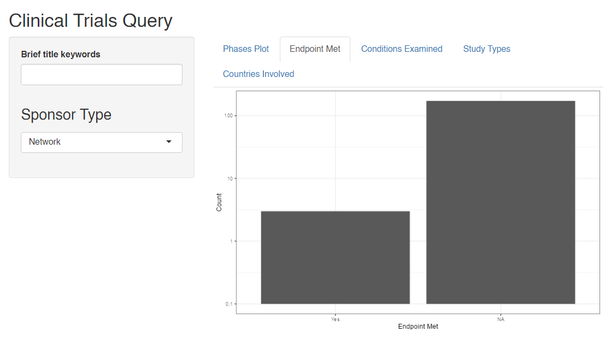

<!-- README.md is generated from README.Rmd. Please edit that file -->

# bis620.2023

<!-- badges: start -->

[](https://github.com/leafsphere/bis620.2023_assn3/actions/workflows/R-CMD-check.yaml)
[](https://github.com/leafsphere/bis620.2023_assn3/actions/workflows/test-coverage.yaml)
<!-- badges: end -->

The goal of `bis620.2023` is to provide a user-friendly interface that
allows the viewer to explore a large database of clinical studies.
Inside lies an R Shiny app that serves as an interactive dashboard,
allowing the user to query trials based on their keyword(s) of interest
and subsequently shows relevant data visualizations and tables
pertaining to the results, such as what phases the studies were in, what
countries were involved, and what conditions were examined.

## Links

- [Test
  Coverage](https://github.com/leafsphere/bis620.2023_assn3/actions/workflows/test-coverage.yaml)

## Installation

You can install the development version of bis620.2023 from
[GitHub](https://github.com/) with:

``` r
# install.packages("devtools")
devtools::install_github("leafsphere/bis620.2023_assn3")
```

## Examples

Here are some screenshots of what you can do on the Shiny app:

<figure>

<figcaption aria-hidden="true">Endpoints Histogram</figcaption>
</figure>
