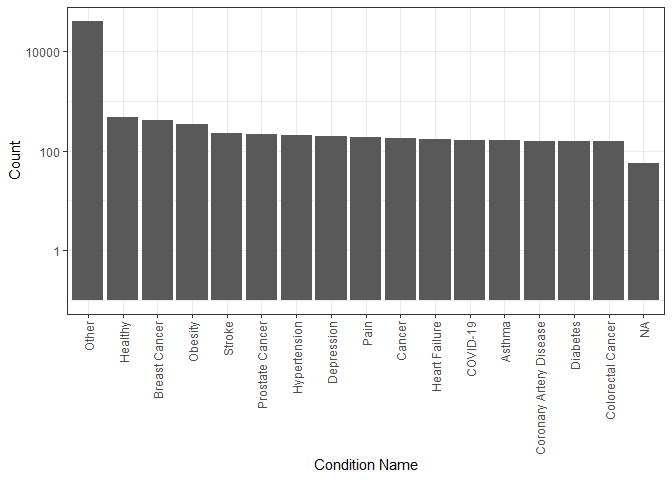
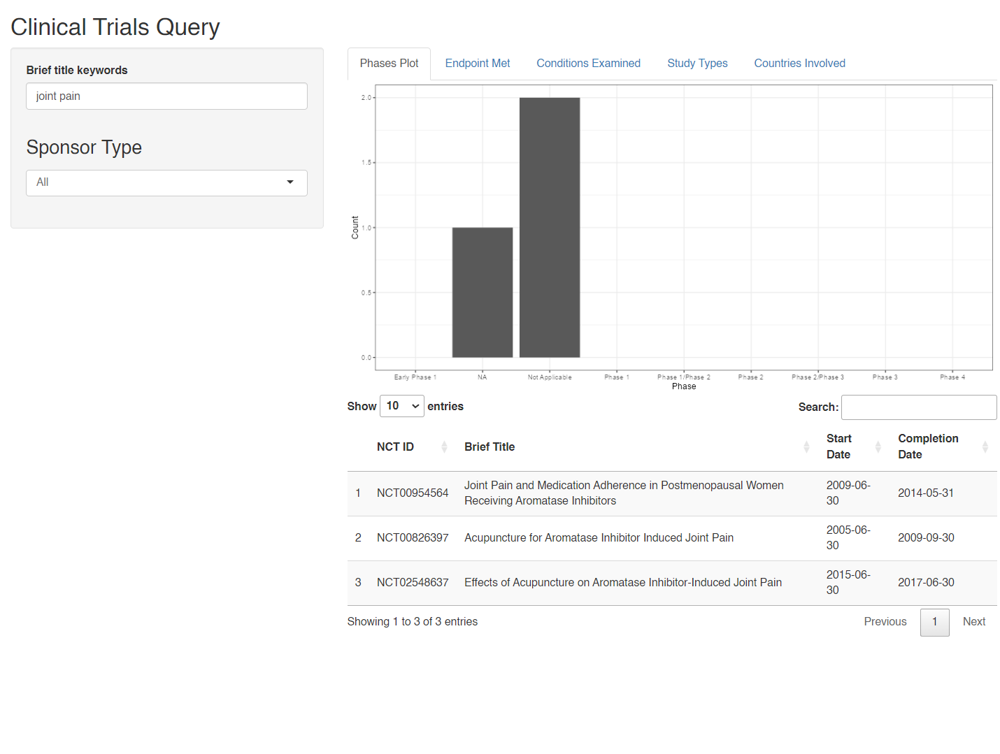
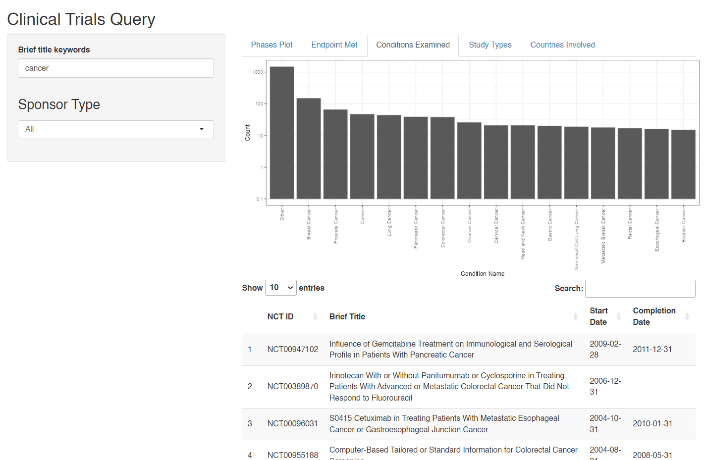
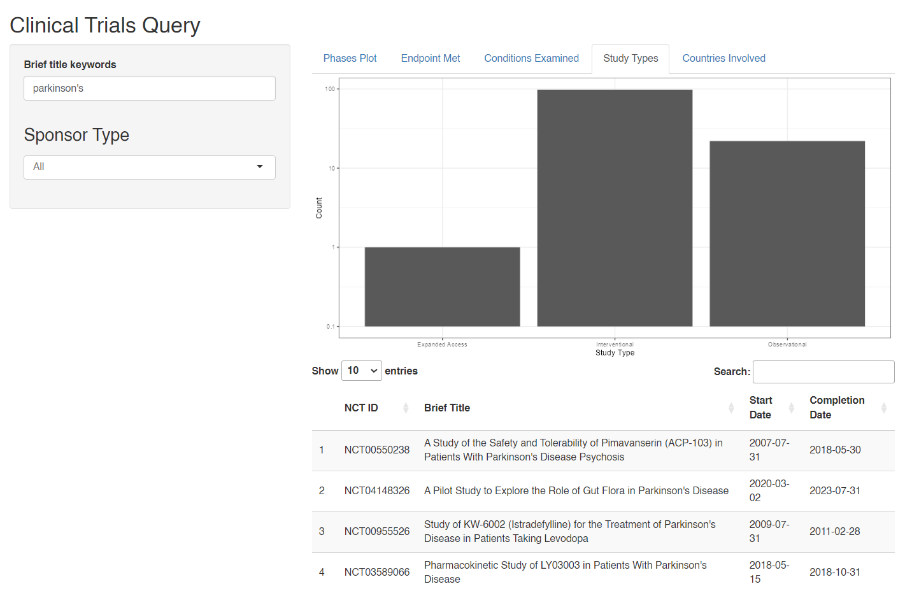

<!-- README.md is generated from README.Rmd. Please edit that file -->

# bis620.2023

<!-- badges: start -->

[](https://github.com/leafsphere/bis620.2023_assn3/actions/workflows/R-CMD-check.yaml)
[](https://github.com/leafsphere/bis620.2023_assn3/actions/workflows/test-coverage.yaml)
<!-- badges: end -->

The goal of `bis620.2023` is to provide a user-friendly interface that
allows the viewer to explore a large database of clinical studies.
Inside lies an R Shiny app that serves as an interactive dashboard,
allowing the user to query trials based on their keyword(s) of interest
and subsequently shows relevant data visualizations and tables
pertaining to the results, such as what phases the studies were in, what
countries were involved, and what conditions were examined.

A final write-up that analyzes CDC/ATSDR Social Vulnerability Index data
and wildfire risk data is included as a vignette and linked in the next
section.

## Links

- [Final
  Write-up](https://leafsphere.github.io/bis620.2023_assn3/articles/final-writeup.html)
- [Test
  Coverage](https://github.com/leafsphere/bis620.2023_assn3/actions/workflows/test-coverage.yaml)

## Installation

You can install the development version of bis620.2023 from
[GitHub](https://github.com/) with:

``` r
# install.packages("devtools")
devtools::install_github("leafsphere/bis620.2023_assn3")
```

## Examples

You can see the top conditions examined in the studies as such:

``` r
library(bis620.2023)
data(studies)
data(conditions)
create_conditions_histogram(studies, conditions)
```



You can also see a list of the top countries involved in the studies:

``` r
create_topcountries_table(studies, countries) |> head(10)
#> # A tibble: 10 × 2
#>    Country            Count
#>    <chr>              <int>
#>  1 United States       9610
#>  2 France              1872
#>  3 China               1682
#>  4 Canada              1473
#>  5 Germany             1356
#>  6 United Kingdom      1334
#>  7 Spain               1159
#>  8 Italy               1082
#>  9 Korea, Republic of   797
#> 10 Belgium              680
```

Here are some screenshots of what you can do on the Shiny app:

  

  

  
